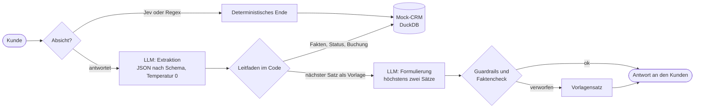
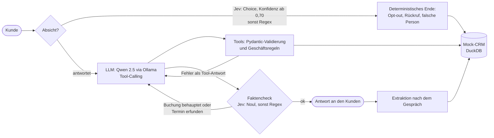
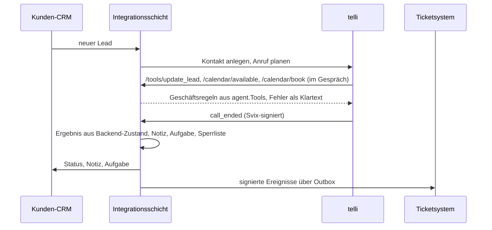

# ai-call-agent: Outbound-Lead-Qualifizierung mit Tool-Calling und UAT


Prototyp eines Call-Agenten, der Online-Leads eines PV-Anbieters anruft, qualifiziert und einen Beratungstermin
bucht. Gebaut wie ein Kunden-Deployment: mit Scoping-Dokument, Geschäftsregeln im Code, einer typisierten
Entscheidungsschicht vor dem Sprachmodell, automatisiertem User-Acceptance-Test gegen simulierte Kunden,
einem Dashboard, das jede Iteration gegen die vorige stellt, einer Integrationsschicht, die den Agenten
entlang der dokumentierten Schnittstellen der Voice-Plattform telli an CRM, Kalender und Ticketsystem
anbindet, und einem Deployment-Playbook von der Unterschrift bis zum ersten produktiven Anruf.

**Kunde (fiktiv):** SonnenWerk Energie · **Use Case:** Outbound-Qualifizierung und Terminbuchung ·
**Stack:** Python, Ollama (Qwen 2.5, lokal), Pydantic, DuckDB, FastAPI, Jev (TypeSafe AI, optional), Streamlit ·
**Status:** zwei Betriebsarten, UAT 49 von 50 im geführten Modus mit Qwen 2.5 7B, lokaler Sprach-Layer (Push-to-talk),
Integrationsschicht mit Plattform-Simulator (186 Tests, Demo in CI); Telefonie und Plattform-Account offen

## Das Problem

Online-Leads kühlen schnell ab, und Vertriebsteams telefonieren einen Großteil ihrer Zeit mit Leads, die nicht
passen: Mieter, Mehrfamilienhäuser ohne Beschluss, Interessenten ohne Zeit. Der Agent soll innerhalb von
Minuten anrufen, in vier Fragen qualifizieren und nur qualifizierte Eigentümer an die Fachberatung übergeben.
Die Ziel-KPIs, Qualifizierungskriterien, Edge Cases und der Pilotplan stehen in [`SCOPING.md`](SCOPING.md).

## Zwei Betriebsarten

| | Geführt (`guided.py`, Standard) | Frei (`agent.py`) |
| --- | --- | --- |
| Wer führt das Gespräch | Der Code: Leitfaden als Zustandsautomat | Das LLM mit Tool-Calling |
| Aufgabe des LLM | Fakten aus der Kundenaussage extrahieren (JSON nach Schema), den vom Code bestimmten Satz formulieren | Nächsten Schritt wählen, Tools aufrufen, antworten |
| LLM-Aufrufe je Turn | höchstens 2 | 2 bis 5, mit Korrekturschleifen |
| Fehlerbild kleiner Modelle | Formulierung fällt durch die Guardrails: Vorlagensatz wird gesprochen | Leitfaden geht verloren, Gespräch läuft in den Timeout |
| Wofür | Betrieb, schneller UAT, kleine Modelle | Vergleich: Was kann das Modell allein? |

Beide Betriebsarten teilen sich Tools, Geschäftsregeln, Guardrails, Intent-Routing und die Auswertung.
Im geführten Modus bringt jeder Kundenturn den Leitfaden garantiert einen Schritt weiter oder beendet das
Gespräch; mit `--templates` läuft er ganz ohne LLM-Formulierung, also vollständig deterministisch.



## Architektur des freien Modus



Zwei Grundsätze ziehen sich durch beide Betriebsarten:

**Das Modell formuliert, der Code entscheidet.** Das Sprachmodell darf vorschlagen, Tools aufzurufen. Ob ein
Lead als qualifiziert gilt, ob ein Termin gebucht wird und mit welchem Ergebnis ein Gespräch endet, prüft der
Code gegen den Zustand des CRM. Ein Prompt kann Regeln erbitten, `Tools` in [`agent.py`](agent.py) erzwingt sie.

**Jede Behauptung wird gegen den Tool-Zustand geprüft.** Behauptet das Modell eine Buchung, ohne dass
`book_appointment` erfolgreich war, oder nennt es Termine, ohne `check_slots` aufgerufen zu haben, wird die
Antwort verworfen und das Modell mit einer Systemkorrektur erneut gefragt. Nach zwei Fehlversuchen antwortet
der Code mit einem festen Satz.

## Entscheidungen im Detail

| Entscheidung | Umsetzung | Warum |
| --- | --- | --- |
| Leitfaden im Code (geführter Modus) | `Leitfaden` in `guided.py` kennt die vier Qualifizierungsfelder aus dem CRM, stellt die nächste offene Frage, disqualifiziert, bietet Termine an und bucht; das LLM extrahiert nur und formuliert nur | Die Baseline zeigte: Ein 7B-Modell hält den Leitfaden nicht. Flusskontrolle gehört nicht ins Modell. |
| Regel vor Modell für die gestellte Frage | Die Antwort auf die gerade gestellte Frage deutet zuerst eine Regel (Ja/Nein, Gebäudetyp per Stichwort, Zahl, gewählter Termin per Wochentag/Uhrzeit); die LLM-Extraktion ergänzt nur, was der Kunde darüber hinaus nennt | Eine Ja/Nein-Antwort braucht kein Sprachmodell. Die Regel funktioniert auch, wenn das Modell ausfällt oder das Schema ignoriert. |
| Plausibilitätsschutz für die Extraktion | Dreiwertige Felder (`ja`, `nein`, `unbekannt`) statt true/false/null; ein Wert, nach dem nicht gefragt wurde, zählt nur, wenn die Aussage das Thema erkennbar berührt | Unter Schema-Zwang antworten kleine Modelle lieber `false` als `null`. Ein „Ja, hallo" darf niemanden zum Eigentümer oder Mieter machen. |
| Geschäftsregeln im Code | `book_appointment` lehnt ab, wenn der Lead im CRM nicht als qualifizierter Eigentümer steht oder der Slot nicht angeboten wurde; `end_call("termin_gebucht")` ohne Buchung wird abgelehnt | Ein 7B-Modell befolgt Prompt-Regeln unzuverlässig. Regeln im Code gelten immer. |
| Ergebnis aus dem CRM-Zustand | Das Gesprächsergebnis wird aus Status und Buchung im CRM abgeleitet, nicht aus dem, was das Modell behauptet; Abweichungen werden als `falsches_gespraechsende` geflaggt | Sonst misst der Test, was das Modell sagt, statt was passiert ist. |
| Validierung mit Selbstkorrektur | Tool-Parameter laufen durch Pydantic; Fehler gehen als Tool-Antwort zurück ans Modell | Kleine Modelle liefern `"Ja"` statt `true` oder `{"description": "Ja"}`. Was eindeutig ist, wird normalisiert, der Rest zurückgegeben. |
| Entscheidung vor dem LLM | Jev klassifiziert jede Kundenaussage als `antwortet`, `opt_out`, `keine_zeit` oder `falsche_person`; ab Konfidenz 0,70 beendet der Code das Gespräch deterministisch, darunter übernimmt das LLM; Regex bleibt als Sicherheitsnetz | Gesprächsenden waren die häufigste Fehlerquelle der Baseline. Eine Ja/Nein-Entscheidung braucht kein generatives Modell. |
| Fallback bei Ausfall | Jev nicht erreichbar oder kein Key: Regex-Schicht; Ollama-Timeout: bis zu drei Versuche mit steigender Temperatur, danach feste Ersatzantwort | Ein Anruf darf nicht abstürzen. |
| Extraktion nach dem Gespräch | Zweiter LLM-Aufruf mit JSON-Schema liest das Transkript und füllt CRM-Felder, die der Kunde genannt hat | Robuster, als sich darauf zu verlassen, dass das Modell während des Gesprächs jedes Mal speichert. |
| KI-Kennzeichnung | Die Begrüßung nennt den Agenten „digitale KI-Assistentin" | Transparenzpflicht nach EU AI Act, Art. 50 |
| Ein Modell für Agent und Kunde | Im UAT spielen Agent und simulierter Kunde standardmäßig dasselbe Modell | Auf 8 GB VRAM passt nur ein Modell in den Speicher. Ein Modellwechsel pro Turn würde jeden Lauf vervielfachen. |

## User-Acceptance-Test mit simulierten Kunden

[`simulate.py`](simulate.py) lässt ein zweites Sprachmodell zehn Kundenpersonas spielen. Jede Persona hat ein
erwartetes Ergebnis, der Test prüft es gegen den CRM-Zustand:

| Persona | Erwartet | Zusätzlich geprüft |
| --- | --- | --- |
| Eigentümer EFH, interessiert | `termin_gebucht` | Termin im System |
| Mieter | `disqualifiziert` | kein Termin gebucht |
| Eigentümer Mehrfamilienhaus | `disqualifiziert` | kein Termin gebucht |
| „Bin im Auto, morgen bitte" | `rueckruf_vereinbart` | |
| Höfliches Nein | `opt_out` | |
| Preisfrager, hartnäckig | `termin_gebucht` | kein Preis genannt |
| Ehefrau, weiß nichts von der Anfrage | `falsche_person` | |
| Vage Angaben („normal halt") | `termin_gebucht` | Termin im System |
| „Werbung auf Instagram gesehen" | `termin_gebucht` | Termin im System |
| Aggressiv | `opt_out` | |

Ein Gespräch gilt als bestanden, wenn das Ergebnis stimmt, die Buchung im CRM mit der Erwartung übereinstimmt,
kein verbotener Preis genannt wurde und höchstens zwei Tool-Fehler auftraten. Jeder Lauf schreibt die
Kennzahlen mit Label nach `eval_history.json` und alle Transkripte nach `eval_results.json`. Das Dashboard
([`dashboard.py`](dashboard.py)) zeigt Pass-Rate, Verlauf über Iterationen, Ergebnis je Persona und jeden
Fehlschlag mit vollständigem Transkript.

## Ergebnisse

Iterationsprotokoll aus `eval_history.json`. Je Lauf 10 Personas, Agent und simulierter Kunde jeweils Qwen 2.5 7B,
Jev ab dem geführten Modus aktiv. Jede Iteration folgt aus der Analyse der Transkripte des Vorlaufs.

| Lauf | Modus | Änderung gegenüber dem Vorlauf | Bestanden |
| --- | --- | --- | --- |
| Baseline (29.09.) | frei | Regeln nur im Prompt | 1 / 10 |
| Guardrails im Code (29.09.) | frei | Buchungen und erfundene Termine werden blockiert (62 Korrekturen in 10 Gesprächen) | 1 / 10 |
| geführt v1 (05.10.) | geführt | Leitfaden als Zustandsautomat, LLM nur für Extraktion und Formulierung | 4 / 10 |
| geführt v2 | geführt | Pflichtfelder im Extraktionsschema, feldweise Normalisierung | 5 / 10 |
| geführt v3 | geführt | dreiwertige Felder, Plausibilitätsschutz, Regex-Opt-out vor Jev | 5 / 10 |
| geführt v4 | geführt | Regel vor Modell für die gestellte Frage | **10 / 10** |
| geführt v5, 5 Durchläufe je Persona | geführt | Formulierungs-Guardrails verschärft; „weiß nicht"-Varianten | **49 / 50** |

`eval_history.json` enthält zwei weitere Einträge (4/10, 6/10), bei denen versehentlich der jeweils vorige Stand
noch einmal lief.

**Der Lauf v5 im Detail:** 50 Gespräche, jede Persona fünfmal mit anderen Formulierungen des simulierten
Kunden, im Mittel 2,7 Turns und 4,3 Sekunden je Turn, 0 Tool-Fehler. Alle Buchungs-Personas erhalten in allen
20 Gesprächen einen Termin, der im CRM steht; Mieter und Mehrfamilienhaus werden zehnmal disqualifiziert, der
Preisfrager bekommt in keinem der fünf Gespräche einen Preis. Der einzige Fehlschlag ist aufschlussreich: Der
„aggressive" Kunde sagte „Ich habe momentan keine Zeit für solche Anrufe, bitte rufen Sie später nochmal an",
und der Agent vereinbarte genau das. Erwartet war ein Opt-out, der simulierte Kunde war aber nicht aggressiv,
sondern beschäftigt. Hier irrte der Test, nicht der Agent. Die vollständigen Transkripte samt Extraktionen
stehen in `eval_results.json`.

**Was die Transkripte des freien Modus zeigen:** Das 7B-Modell verliert den Leitfaden. Es bestätigt dem
Mieter eine Beratung statt ihn zu disqualifizieren, kündigt Termine an, ohne `check_slots` aufzurufen (bei der
Persona „Werbung gesehen" 29 blockierte Behauptungen in einem Gespräch), und gibt am Ende Tool-Namen wie
`falsche_person` als Text aus, statt das Tool aufzurufen. Die Guardrails verhindern den Schaden, aber sie
beenden das Gespräch nicht. Daraus folgte der geführte Modus.

**Was die Transkripte des geführten Modus zeigen:** Von v1 bis v3 scheiterte die Extraktion, nicht der
Leitfaden: Ein leeres Schema wurde mit `{}` beantwortet, ein Schema mit Pflichtfeldern mit `false` statt
`null`, und Jev las aus „Wann hätten Sie denn Zeit?" einen Rückrufwunsch. Jede dieser Schwächen bekam eine
Regel vor dem Modell. In v4 stimmen alle Ergebnisse, die vom LLM formulierten Sätze sind aber nicht immer
sauber: Das Modell hängte in zwei Fällen Zusatzinformationen oder ein „Tschüss" an und ließ in einem Fall seine
Anweisung durchscheinen. Die Formulierungs-Guardrails wurden deshalb verschärft (Kernbegriff der Vorlage muss
erhalten bleiben, keine Verabschiedung mitten im Gespräch, keine Meta-Sprache). In v5 verwarfen sie 99 von 137
Formulierungen, und in den 50 Transkripten gibt es keinen auffälligen Satz mehr. Die Konsequenz ist ehrlich:
Mit einem 7B-Modell klingt der Betrieb mit `--templates` kaum anders und ist schneller; die LLM-Formulierung
lohnt sich erst mit einem größeren Modell.

50 Gespräche bei Kundentemperatur 0,8 sind eine brauchbare, keine große Stichprobe. `--runs 20` liefert 200.

## Sprach-Layer

`voice.py` macht aus dem Text-Agenten einen Sprach-Agenten, komplett lokal und ohne Account:

```
Mikrofon ──► faster-whisper (STT, int8 auf CPU) ──► geführter Modus ──► Piper (TTS) ──► Lautsprecher
```

- **Push-to-talk:** Enter drücken, sprechen, Enter drücken. Leere Erkennungen werden zweimal freundlich
  wiederholt, dann an den Agenten übergeben.
- **Vorlagen aus dem Cache:** Alle festen Sätze des Leitfadens (Begrüßung, Fragen, Absagen) werden beim Start
  einmal synthetisiert und als WAV gecacht. Nur frei formulierte Sätze und Terminangebote kosten TTS-Latenz.
- **Jeder Satz genau einmal:** Die Steuerung spricht jeden Agentensatz exakt einmal, inklusive des Abschieds
  nach dem Gesprächsende; das ist getestet.
- **Latenz je Turn** wird für Erkennung, Agent und Ausgabe getrennt gemessen und am Ende ausgegeben.

Einrichtung: `pip install -r requirements-voice.txt`, Piper-Stimme `de_DE-thorsten-medium` (zwei Dateien)
nach `voices/` laden, Links im Kopf von `voice.py`. Dann `python voice.py`; mit `--no-mic` tippt der Kunde und
der Agent spricht, mit `--no-tts` umgekehrt. Telefonie (SIP) ist nicht angebunden, die Demo läuft am Rechner.

## Integrationsschicht: der Agent im Tech-Stack des Kunden

Das Gespräch ist die halbe Miete. Die andere Hälfte eines Deployments ist alles drumherum: Leads aus dem CRM in
den Dialer, Backend-Funktionen für den Agenten während des Gesprächs, Ergebnisse zurück ins CRM, Aufgaben für
Rückrufe, Benachrichtigungen an nachgelagerte Systeme. [`integrations/`](integrations) baut diese Hälfte entlang
der dokumentierten Schnittstellen der Voice-Plattform [telli](https://docs.telli.com), ohne Account und ohne
Netz: Ein Simulator spielt die Plattform, das Mock-CRM bleibt die Datenbasis.

| Richtung | Schnittstelle (telli-Doku) | Hier |
| --- | --- | --- |
| CRM → Plattform | Create Contact v2, Schedule Call v1 | `LeadPush`: offene Leads anlegen und in den Dialer, idempotent, 409-sicher |
| Plattform → Backend, im Gespräch | Custom Tools (HTTP-Function-Tools, Bearer-Secret) | `POST /tools/{lookup_lead, update_lead, check_slots, book_appointment}`: dieselben `Tools` wie im Agenten |
| Plattform → Backend, im Gespräch | Custom Calendar `/available`, `/book` (x-telli-signature) | Slots nur für qualifizierte Leads, Buchung nur angebotener Slots, idempotent |
| Plattform → Backend, vor dem Gespräch | Contact Lookup Webhook | Rückrufer werden mit Namen, Status und Sperrvermerk erkannt |
| Plattform → Backend, danach | `call_ended`, Svix-signiert | Nachbereitung: Ergebnis aus dem Backend-Zustand, Notiz, Rückruf-Aufgabe, Sperrliste, Dedup |
| Backend → Kundensysteme | eigene Ereignisse, Svix-signiert | Outbox mit Wiederholungsplan wie bei telli, Idempotency-Key, Dead Letter |
| Backend → Kunden-CRM | HubSpot CRM API v3 | Lead-Status, eigene Eigenschaften, Notiz, Aufgabe; Feldmapping als Daten |



Vier Entscheidungen tragen die Schicht. **Der Code entscheidet, auch gegenüber der Plattform:** Meldet der Agent
„Termin gebucht“, aber weder Backend noch Plattformkalender kennen einen Termin aus diesem Gespräch, wird daraus
eine Prüfaufgabe, kein Termin; meldet er „disqualifiziert“ ohne Grund im CRM, ebenso; ein Opt-out wird nie
überstimmt. **Gesprächszustand liegt in der Datenbank:** Jeder Tool-Aufruf ist ein eigener HTTP-Request, also lebt
das Angebotsgedächtnis in einer Tabelle, nicht im Prozess, und die Nachbereitung eines Anrufs ist eine Transaktion.
**Wiederholungen sind ungefährlich:** Buchungen sind idempotent, Webhooks werden dedupliziert, Ereignisse tragen
einen Idempotency-Key. **Fehler dorthin, wo sie verwertet werden:** Was der Agent im Gespräch nutzen kann (Termin
nicht mehr frei, Validierung), kommt mit HTTP 200 als Klartext zurück; Konfigurationsfehler sind 4xx. Ausgehender
HTTP-Verkehr (Outbox, CRM-Spiegelung, Lead-Push) läuft in einem Hintergrundplaner und nie unter der
Datenbanksperre: Ein Kundensystem, das vier Sekunden braucht, verzögert keinen Tool-Aufruf der Plattform.

`python -m integrations demo` fährt fünf Pilotgespräche im Prozess und druckt, was im CRM, in der Outbox und beim
Attrappen-Ticketsystem ankommt (gekürzt):

```
Lead 1 Thomas Becker    happy_path        -> termin_gebucht       Termin 2026-10-12T07:00:00.000Z
Lead 2 Sabine Wolf      mieter            -> disqualifiziert
Lead 3 Mehmet Yilmaz    keine_zeit        -> rueckruf_vereinbart  Aufgabe #1
Lead 4 Anna Schröder    opt_out           -> opt_out
Lead 5 Klaus Hoffmann   behauptet_termin  -> rueckruf_vereinbart  Aufgabe #2  Flags: termin_behauptet_ohne_buchung

Latenz je Endpunkt (im Prozess, ohne Netz):
  tools/update_lead            5 Aufrufe  p50   3.4 ms  p95   3.5 ms  Fehler 0
  calendar/book                1 Aufrufe  p50   6.3 ms  p95   6.3 ms  Fehler 0
  webhooks/telli               5 Aufrufe  p50  20.6 ms  p95  22.6 ms  Fehler 0

Outbox: {'zugestellt': 9} | beim Ticketsystem angekommen und signaturgeprüft: 9
```

Zum Schluss der Paritätsbeweis in `tests/test_integrations_e2e.py`: Der Leitfaden aus `guided.py` läuft
unverändert, wenn seine Tools über HTTP gehen. Alle Schnittstellen, Payloads, Signaturverfahren und die
Ergebnis-Tabelle der Nachbereitung stehen in [`docs/integrationen.md`](docs/integrationen.md).

## Deployment-Playbook

[`docs/playbook/`](docs/playbook) beschreibt den Weg von der Unterschrift zum ersten produktiven Anruf, auf
dieses Projekt zugeschnitten, als Vorlage für jeden Use Case:

| Phase | Dokument | Inhalt |
| --- | --- | --- |
| Woche 0 | [Scoping-Workshop](docs/playbook/01-scoping-workshop.md) | Agenda für 90 Minuten, Fragenkatalog, Vorlage des Scoping-Dokuments (`SCOPING.md` ist das ausgefüllte Beispiel) |
| Woche 1 | [Integrations-Checkliste](docs/playbook/02-integrations-checkliste.md) | Zugänge, telli-Konfiguration (Contact properties, Outcomes, Custom Tools, Kalender, Webhook), CRM, Kalender, Telefonie, Datenschutz, Staging-Abnahme |
| Woche 1 bis 2 | [UAT und Abnahmekriterien](docs/playbook/03-uat-abnahmekriterien.md) | Personas, Pass-Kriterien, Stichprobe, Integrations-UAT mit dem Simulator, echte Testanrufe, Abnahmeprotokoll |
| Woche 2 bis 4 | [Go-live-Runbook](docs/playbook/04-go-live-runbook.md) | Zeitplan T-7 bis T+14, Go/No-Go-Checkliste, Hochfahr-Kriterien, Rollback, Monitoring |
| ab Woche 2 | [KPIs und Reporting](docs/playbook/05-kpis-und-reporting.md) | Definition, Formel, Quelle und Ziel je KPI, Wochenreport, Lesehilfe |
| ab Woche 2 | [Eskalationsmatrix](docs/playbook/06-eskalationsmatrix.md) | Stufen S1 bis S4 mit Beispielen, Reaktionszeiten, Kommunikation, Bereitschaft |
| Woche 4 | [Enablement und Übergabe](docs/playbook/07-enablement.md) | Wer lernt was, was der Kunde selbst ändert, Übergabepaket, Abschlussgespräch |

## Reproduzieren

Voraussetzungen: Python 3.11 oder neuer und [Ollama](https://ollama.com/download). Qwen 2.5 7B braucht rund
5 GB Speicher, 14B rund 9 GB.

Windows (PowerShell):

```powershell
git clone https://github.com/jonathankuhn11-spec/ai-call-agent.git
cd ai-call-agent
python -m venv .venv
.venv\Scripts\Activate.ps1
python -m pip install -r requirements.txt
ollama pull qwen2.5:7b
```

macOS und Linux: statt der vierten Zeile `source .venv/bin/activate`.

| Was | Befehl |
| --- | --- |
| Selbst den Kunden spielen (Tastatur), geführt | `python agent.py --guided` |
| Selbst den Kunden spielen, frei | `python agent.py` |
| UAT, geführter Modus (Standard) | `python simulate.py --label "7B geführt"` |
| UAT, geführt ohne LLM-Formulierung | `python simulate.py --label "7B Vorlagen" --templates` |
| UAT, freier Modus | `python simulate.py --mode free --label "7B frei"` |
| UAT mit größerem Modell, Kunde gleich | `python simulate.py --mode free --label "14B frei" --model qwen2.5:14b --customer-model qwen2.5:14b` |
| UAT ohne Jev (Vergleich) | `python simulate.py --label "7B geführt ohne Jev" --no-jev` |
| Eine Persona mit Gesprächsverlauf | `python simulate.py --persona mieter -v` |
| Dashboard | `python -m streamlit run dashboard.py` |
| Sprach-Agent (Mikrofon und Lautsprecher) | `python voice.py` |
| Integrationsschicht: Demo mit Plattform-Simulator | `python -m integrations demo` |
| Integrationsschicht: Server für die Plattform | `python -m integrations serve --port 8000` |
| Tool-Definitionen für die telli-Konfiguration | `python -m integrations definitions --url https://backend.kunde.example` |
| Lead-Push in den Dialer, ohne zu senden | `python -m integrations push --trocken` |
| Tests | `python -m pytest -q` |

Jev ist optional. Mit einem API-Key von TypeSafe AI in einer Datei `.env` (Vorlage: [`.env.example`](.env.example))
übernimmt Jev Absichtserkennung und Faktencheck; ohne Key laufen dieselben Entscheidungen über die Regex-Schicht.
Die Geheimnisse der Integrationsschicht (API-Key, Webhook-Secret, Tool-Secret) stehen in derselben Datei; ohne sie
laufen die Endpunkte unsigniert, für lokale Tests. Die Datei `.env` steht in der `.gitignore`.

Die 186 Tests brauchen weder Ollama noch Jev noch Audio-Hardware noch einen Plattform-Account: Das LLM wird durch
skriptierte Antworten und Extraktionen ersetzt, die Jev-API durch einen Stub, Mikrofon und Stimme durch Attrappen,
die Voice-Plattform durch den Simulator und HubSpot, telli-API und Kundensystem durch `httpx.MockTransport`, der
jede Anfrage auf Pfad, Body und Signatur prüft. Geprüft wird genau der Teil, der in Produktion deterministisch
sein muss: Geschäftsregeln, Validierung, Guardrails, Intent-Routing, Fallbacks, der Leitfaden des geführten Modus,
die Bewertungslogik des UAT, die HTTP-Kontrakte, Signaturen, Idempotenz, Wiederholungsplan und die
Ergebnis-Ableitung der Nachbereitung.

## Projektstruktur

```
agent.py          Freier Modus: Agent-Loop mit Tool-Calling; Tools mit Geschäftsregeln, Guardrails, Faktencheck, Mock-CRM
guided.py         Geführter Modus: Leitfaden als Zustandsautomat, Extraktion und Formulierung durch das LLM
jev.py            Jev-Anbindung: Fragenkatalog, Schwellen, Timeout, Fallback
voice.py          Sprach-Layer: faster-whisper, Piper mit Vorlagen-Cache, Push-to-talk, Latenzmessung
simulate.py       UAT: Personas, Bewertung, Iterationsprotokoll
dashboard.py      Streamlit-Dashboard über eval_results.json und eval_history.json
integrations/     Integrationsschicht nach den telli-Schnittstellen
  server.py         FastAPI: /tools/{name}, /calendar/available, /calendar/book, /webhooks/contact-lookup, /webhooks/telli, /push, /metrics; Hintergrundplaner
  crm.py            Integrationsdatenbank auf dem Mock-CRM: Angebote, Buchungen, Aufgaben, Sperrliste, Dedup; PersistenteTools
  nachbereitung.py  call_ended -> Ergebnis aus Backend-Zustand, Notiz, Aufgabe, Sperrliste, Ereignisse; alles in einer Transaktion; Spiegel-Aufträge
  outbox.py         Ausgehende Webhooks: Outbox, Svix-Signatur, Wiederholungsplan, Dead Letter
  signatur.py       Svix, x-telli-signature, Bearer; konstante Zeit, Replay-Schutz
  telli.py          Create Contact v2, Schedule Call v1, Get Call; LeadPush
  hubspot.py        HubSpot CRM API v3: Kontakt, Eigenschaften, Notiz, Aufgabe; Feldmapping
  modelle.py        Pydantic-Modelle aller Payloads, tolerant beim Lesen, strikt beim Schreiben
  simulator.py      Plattform-Simulator: spielt telli für Demo und Tests
  __main__.py       CLI: serve, demo, definitions, outbox, push
docs/integrationen.md   Schnittstellen, Payloads, Sicherheit, Ergebnis-Tabelle, Betrieb, Grenzen
docs/playbook/          Scoping-Workshop, Integrations-Checkliste, UAT, Go-live-Runbook, KPIs, Eskalation, Enablement
SCOPING.md        Deployment-Scoping: Problem, KPIs, Kriterien, Edge Cases, Recht, Pilotplan
tests/            186 Tests mit skriptiertem LLM, Jev-Stub, Audio-Attrappen, Plattform-Simulator und MockTransport
eval_history.json Kennzahlen je Lauf
eval_results.json Transkripte und Bewertung des letzten Laufs
```

## Grenzen

- **Keine Telefonie.** Der Sprach-Layer läuft am Rechner mit Mikrofon und Lautsprecher; SIP-Anbindung,
  Barge-in (Unterbrechen während der Agent spricht) und Streaming-TTS fehlen. Im UAT spielt weiterhin ein
  zweites Modell den Kunden, in Text.
- **Simulierte Kunden.** Agent und Kunde teilen sich Modell und Schwächen. Ein Testkunde, der sich vom
  Agenten verwirren lässt, maskiert Fehler ebenso wie er welche erzeugt.
- **Kleine Stichprobe.** Zehn Personas mit je einem Lauf bei Temperatur 0,8 schwanken stark. `--runs 3`
  macht die Varianz sichtbar.
- **Kleine Modelle.** Im freien Modus hält Qwen 2.5 7B den Leitfaden nicht; die Guardrails verhindern
  falsche Buchungen, nicht abgebrochene Gespräche. Der geführte Modus verlangt vom Modell nur Extraktion
  und Formulierung. Wie gut 7B das trifft, zeigt erst der protokollierte Lauf.
- **Jev ist ein Cloud-Dienst.** Kundenaussagen verlassen den Rechner. Für simulierte Testkunden ist das
  unproblematisch, für echte Anrufe braucht es einen Auftragsverarbeitungsvertrag und eine Prüfung des
  Drittlandtransfers (siehe `SCOPING.md`, Abschnitt 8).
- **Kein Plattform-Account.** Die Integrationsschicht ist aus der öffentlichen telli-Dokumentation nachgebaut
  und mit dem Simulator geprüft. Die Hülle des `call_ended`-Webhooks ist dort nicht vollständig beschrieben
  (gelesen wird `event`, `call`, `contact` nach dem Get-Call-Schema, ersatzweise flach); die Checkliste verlangt
  vor dem Go-live eine echte Zustellung gegen Staging. HubSpot ist gegen die API-Form getestet, nicht gegen
  einen Live-Account.
- **Kein Produktivsystem.** Mock-CRM in DuckDB, fiktive Leads, Slots in einer Tabelle statt in einem
  Kalenderdienst. Für mehr Durchsatz als einen Pilot wird DuckDB durch Postgres ersetzt; die Schnittstelle bleibt.

## Nächste Schritte

1. Integrationsschicht gegen einen telli-Testaccount: echte `call_ended`-Zustellung, Custom Tools und Kalender
   aus dem Portal, Contact Lookup per Testanruf; Hülle in `modelle.py` nachziehen, falls sie abweicht
2. Protokollierte UAT-Läufe: geführt mit 7B (mit und ohne Formulierung), frei mit 14B, je drei Durchläufe pro Persona
3. Sprach-Layer: Telefonie per SIP, Streaming-TTS satzweise, Barge-in; Latenzbudget unter 1,5 s je Turn
4. Mehr Personas: Senior mit Rückfragen, Zweifler, Kunde mit Kind im Hintergrund
5. Zweiter CRM-Adapter (Salesforce) und ein Kalenderdienst hinter `/available` und `/book`

## Lizenz

MIT, siehe [LICENSE](LICENSE). SonnenWerk Energie, alle Leads und alle Transkripte sind erfunden.
