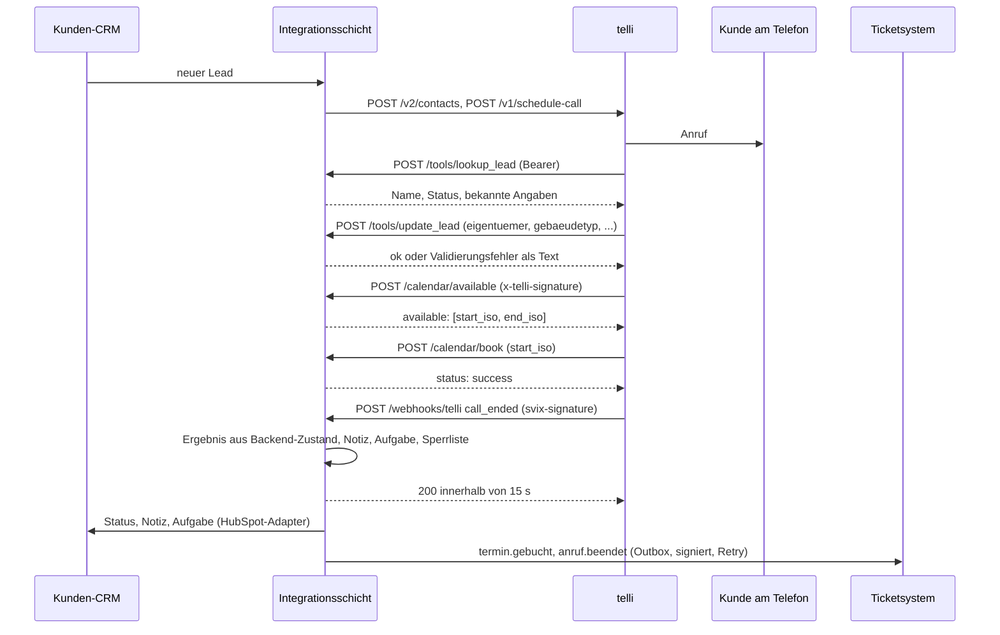

# Integrationsschicht: Der Agent im Tech-Stack des Kunden

Das Gespräch ist die halbe Miete. Die andere Hälfte eines Deployments ist alles drumherum: Leads
aus dem CRM in den Dialer, Backend-Funktionen für den Agenten während des Gesprächs, Ergebnisse
zurück ins CRM, Aufgaben für Rückrufe, Benachrichtigungen an nachgelagerte Systeme. Das Paket
[`integrations/`](../integrations) baut diese Hälfte entlang der dokumentierten Schnittstellen
der Voice-Plattform [telli](https://docs.telli.com). Es läuft komplett lokal gegen das Mock-CRM
in DuckDB; ein Simulator spielt die Plattform.

| Richtung | Schnittstelle (telli-Doku) | Endpunkt / Modul |
| --- | --- | --- |
| CRM → Plattform | Create Contact v2, Schedule Call v1 | `telli.py` (`LeadPush`) |
| Plattform → Backend, im Gespräch | Custom Tools (HTTP-Function-Tools) | `POST /tools/{name}` |
| Plattform → Backend, im Gespräch | Custom Calendar (`/available`, `/book`) | `POST /calendar/available`, `POST /calendar/book` |
| Plattform → Backend, vor dem Gespräch | Contact Lookup Webhook | `POST /webhooks/contact-lookup` |
| Plattform → Backend, nach dem Gespräch | Webhook `call_ended`, Svix-signiert | `POST /webhooks/telli` → `nachbereitung.py` |
| Backend → Kundensysteme | eigene Ereignisse, Svix-signiert, Outbox | `outbox.py` |
| Backend → Kunden-CRM | HubSpot CRM API v3 (Kontakt, Notiz, Aufgabe) | `hubspot.py` |

## Ein Pilotgespräch, Ende zu Ende



`python -m integrations demo` fährt genau diesen Ablauf mit fünf Personas im Prozess, ohne Account
und ohne Netz, und druckt CRM-Zustand, Latenzen und die beim Attrappen-Ticketsystem angekommenen,
signaturgeprüften Ereignisse. In CI läuft die Demo bei jedem Push.

## Grundsätze

**Der Code entscheidet, auch gegenüber der Plattform.** Jede Buchung und jede Statusänderung läuft
durch `agent.Tools` mit denselben Geschäftsregeln wie im lokalen Agenten: qualifiziert heißt
Eigentümer und bekannter Gebäudetyp, kein Mehrfamilienhaus; gebucht wird nur ein Termin, der diesem
Lead angeboten wurde und noch frei ist. Die Nachbereitung leitet das Gesprächsergebnis aus dem
Zustand des Backends ab, nicht aus der Behauptung des Agenten.

**Gesprächszustand liegt in der Datenbank.** Jeder Tool-Aufruf der Plattform ist ein eigener
HTTP-Request ohne Gedächtnis. Was dem Lead angeboten wurde, steht deshalb in der Tabelle `angebote`
(`PersistenteTools` in `crm.py`), nicht im Prozess. Der Server ist damit neustartfest. Die
Nachbereitung eines Anrufs ist eine Transaktion: Statusänderung, Notiz, Aufgabe, Sperrvermerk,
Protokoll, Ereignisse und der Dedup-Eintrag stehen zusammen in der Datenbank oder gar nicht.

**Wiederholungen sind ungefährlich.** Die Plattform wiederholt Webhooks nach jedem Nicht-2xx und
kann Tool-Aufrufe nach einem Timeout erneut stellen (für Custom Tools dokumentiert telli kein
Wiederholungsverhalten, der Agent selbst darf es aber jederzeit noch einmal versuchen). Deshalb ist jede Buchung idempotent (derselbe Lead, derselbe Slot:
derselbe Erfolg; ein anderer Slot: Umbuchung, der alte wird frei), jeder `call_ended`-Webhook wird
über Nachrichten-ID und Call-ID dedupliziert, und jedes ausgehende Ereignis trägt einen
Idempotency-Key.

**Tolerant lesen, strikt schreiben.** Payloads der Plattform werden mit `extra="ignore"` gelesen;
neue Felder bei telli brechen nichts. Was diese Schicht antwortet oder sendet, ist exakt nach
Kontrakt geformt (`extra="forbid"`, Zeitformate, Feldnamen).

**Fehler dorthin, wo sie verwertet werden.** Fehler, die der Agent im Gespräch verwerten kann
(Lead unbekannt, Termin nicht mehr frei, Validierung), kommen mit HTTP 200 und Klartext im Body
zurück, damit sie das Sprachmodell erreichen. Konfigurationsfehler (unbekanntes Tool, kaputtes
JSON, falsche Signatur) sind 4xx und landen im Plattform-Log.

## 1. Lead-Push: CRM → Dialer

Speed-to-Lead (Ziel unter 5 Minuten, `SCOPING.md`) entscheidet sich hier. `LeadPush.synchronisieren()`
läuft im Hintergrundplaner des Servers (`PUSH_TAKT_S`, Standard 60 s) und auf Zuruf über
`POST /push`, zum Beispiel aus einem CRM-Webhook heraus:

1. Offene Leads ohne telli-Kontakt und ohne Sperrvermerk auswählen.
2. `POST /v2/contacts` (camelCase, `externalId` = Lead-ID, Eigenschaften `quelle`, `plz`, bekannte
   Qualifizierungsfelder). Die Eigenschaften müssen bei telli unter *Settings → Contact properties*
   angelegt sein, sonst werden sie ignoriert.
3. `POST /v1/schedule-call` mit `contact_id` und `agent_id`, optional `max_retry_days`.
4. Kontakt-ID und `loop_id` in `telli_kontakte` speichern.

Idempotent: Wer einen Kontakt hat, wird nicht erneut angelegt; wer einen Kontakt, aber keinen
Anruf hat (Dialer war aus), wird beim nächsten Lauf nachgeholt. Antwortet telli mit
`409 DUPLICATE_EXTERNAL_ID`, wird der Lead einmal gemeldet und zur manuellen Zuordnung vorgemerkt
(`zuordnung_offen()`), nicht bei jedem Lauf neu versucht. `python -m integrations push --trocken`
zeigt die Requests, ohne zu senden.

## 2. Custom Tools: Backend-Funktionen im Gespräch

telli ruft je Custom Tool eine HTTPS-URL mit konfigurierbarem Body auf; der Body besteht aus
Konstanten, System Variables, LLM-Parametern und Secrets. `GET /tools/definitions` (oder
`python -m integrations definitions`) erzeugt die Konfiguration je Tool:

| Body-Schlüssel | Value Type in telli | Wert |
| --- | --- | --- |
| `call_id` | System Variable | `call.id` |
| `external_id` | System Variable | `contact.externalId` |
| `phone_number` | System Variable | `contact.phoneNumber` |
| `status`, `eigentuemer`, `gebaeudetyp`, `dachflaeche_m2`, `jahresverbrauch_kwh`, `notiz`, `slot_id`, `art` | LLM Parameter | aus `agent.TOOL_SCHEMAS`, Datentyp String / Number / Boolean |
| Header `Authorization` | Secret | `Bearer <TOOL_SECRET>` |

Vier Tools stehen bereit: `lookup_lead` (Bekanntes nicht erneut fragen), `update_lead`,
`check_slots`, `book_appointment`. `end_call` gibt es über HTTP nicht: Das Gesprächsende ist Sache
der Plattform, das Ergebnis kommt per `call_ended`. Der Lead wird über `external_id` aufgelöst,
ersatzweise über die normalisierte Telefonnummer. `book_appointment` ist idempotent (Wiederholung
nach Timeout: derselbe Erfolg) und behandelt einen zweiten Slot als Umbuchung; ein Lead hält
höchstens einen Termin. Ein Fakt, der der Qualifizierung widerspricht (ein qualifizierter Lead
sagt, er sei Mieter), wird gespeichert und setzt die Qualifizierung zurück, statt verworfen zu
werden. Jeder Aufruf wird mit Latenz gemessen
(`GET /metrics`); überschreitet ein Tool das Budget (`TOOL_LATENZBUDGET_MS`, Standard 800 ms),
wird es geloggt. telli bricht Tool-Aufrufe nach dem konfigurierten Timeout (1 bis 10 s) ab.

Beispiel:

```http
POST /tools/update_lead
Authorization: Bearer <TOOL_SECRET>
{"call_id": "c_1", "external_id": "3", "phone_number": "+49251000003",
 "status": "in_qualifizierung", "eigentuemer": true, "gebaeudetyp": "DHH"}

200 {"ok": true, "gespeichert": {"status": "in_qualifizierung", "eigentuemer": true, "gebaeudetyp": "doppelhaushaelfte"}}
```

## 3. Custom Calendar: der telli-Kalenderkontrakt

telli kann die Terminbuchung selbst führen und ruft dafür zwei Endpunkte auf. Beide antworten immer
mit HTTP 200; Erfolg oder Misserfolg steht im Body. Zeiten sind UTC, ISO 8601 mit Millisekunden
und `Z`; `start_iso` ist der Slot-Bezeichner.

| Endpunkt | Request (von telli) | Antwort |
| --- | --- | --- |
| `POST /calendar/available` | `contact` (V2-Objekt mit `externalId`, `phoneNumber`, `timezoneIana`), dazu `contact_id`, `external_contact_id`, `contact_details` (V1) | `{"available": [{"start_iso": "...", "end_iso": "..."}]}` |
| `POST /calendar/book` | dasselbe plus `start_iso` | `{"status": "success"}` oder `{"status": "failed", "reason": "Appointment slot is no longer available"}` |

Regeln dahinter: `/available` liefert nur für qualifizierte Leads Slots (sonst eine leere Liste;
der Grund steht im Server-Log, der Body bleibt exakt der Kontrakt) und merkt sich die angebotenen
Slots je Lead 24 Stunden. `/book` ist idempotent: Derselbe Lead, derselbe Slot, zweiter Aufruf nach
einem Timeout ergibt wieder `success`, keine zweite Buchung; ein anderer Slot ist eine Umbuchung.
Belegte oder unbekannte Slots antworten mit dem Standardgrund, nie angebotene oder nicht
qualifizierte mit dem Grund aus der Geschäftsregel.
Beide Endpunkte verlangen `x-telli-signature` (HMAC-SHA256 über den rohen Body, Schlüssel ist
der API-Key), sobald `TELLI_API_KEY` gesetzt ist.

## 4. Contact Lookup: Rückrufer erkennen

Ruft ein Kunde zurück, fragt telli vor dem Verbinden `POST /webhooks/contact-lookup` mit
`{"event": "contact_lookup", "phone_number": "+49...", "to_number": "+49..."}`. Die Antwort ist
`{"contact": null}` oder ein Kontakt mit `first_name`, `last_name`, `external_id`, `phone_number`
und `properties` (Status, Quelle, PLZ, bekannte Angaben, Sperrvermerk). Der Agent begrüßt mit
Namen und weiß, wo das letzte Gespräch aufgehört hat. Die Antwort muss schnell kommen, der
Timeout verlängert das Klingeln.

## 5. `call_ended`: Nachbereitung mit Ground Truth

Der Webhook kommt Svix-signiert (`svix-id`, `svix-timestamp`, `svix-signature`); die Prüfung
steht ohne Fremdbibliothek in `signatur.py`. Wiederholungen der Plattform (gleiche `svix-id`) und
manuelle Replays (gleiche `call_id`, neue ID) werden erkannt und mit `duplikat` beantwortet, ohne
etwas zu verändern. Bricht die Verarbeitung mittendrin ab, rollt die Transaktion zurück, telli
bekommt einen 5xx und wiederholt; die Wiederholung beginnt dann bei null, nichts wird doppelt
angelegt. Die Antwort geht vor jeder Zustellung an Dritte raus (telli erwartet 2xx in
15 Sekunden); Outbox und Spiegelung arbeiten im Hintergrund.

Gelesen wird `{"event": "call_ended", "call": {...}, "contact": {...}}` nach dem Get-Call-Schema,
ersatzweise ein flaches Call-Objekt. Die Hülle ist in der telli-Doku nicht vollständig
beschrieben; die Checkliste verlangt deshalb vor dem Go-live eine echte Zustellung aus dem
Webhook-Portal gegen die Staging-Umgebung.

Das Ergebnis folgt dieser Tabelle, Behauptung des Agenten gegen den Zustand des Backends:

| Backend-Zustand | Agent meldet (`outcomes.ergebnis`) | Ergebnis | Flag |
| --- | --- | --- | --- |
| beliebig | `opt_out` | `opt_out`, Nummer auf die Sperrliste; wird nie überstimmt | `buchung_trotz_opt_out` + Prüfaufgabe, falls im selben Gespräch gebucht wurde |
| Buchung in unserer DB **aus diesem Gespräch** (ab `started_at`) | beliebig außer `opt_out` | `termin_gebucht` | `ergebnis_korrigiert`, wenn anders gemeldet; ein Termin aus einem früheren Anruf zählt nicht |
| keine Buchung, `appointments[].status = booked` (native Kalenderanbindung) | beliebig | `termin_gebucht` | `termin_extern`; Status wird auf qualifiziert gesetzt, bei fehlenden Fakten `status_verworfen` |
| keine Buchung | `termin_gebucht` | `rueckruf_vereinbart` + Aufgabe „Prüfen“ | `termin_behauptet_ohne_buchung` |
| CRM kennt Mieter oder Mehrfamilienhaus | `disqualifiziert` | `disqualifiziert` | |
| CRM kennt keinen Grund | `disqualifiziert` | `rueckruf_vereinbart` + Aufgabe „Prüfen“ | `disqualifiziert_ohne_grund` |
| | `rueckruf_vereinbart` | Aufgabe zum Wunschzeitpunkt (`rueckruf_zeitpunkt`, sonst `follow_up`, sonst +24 h) | |
| | `falsche_person`, `kein_interesse` | übernommen | |
| | fehlt | `sonstiges` | `ergebnis_fehlt`, `frueh_aufgelegt` |
| `status` ≠ `connected` | | `nicht_erreicht`, Lead unverändert | `mehrfach_nicht_erreicht` ab Versuch 3 |

Qualifizierungsfelder aus `outcomes` oder `collected_data` (nur `confirmed`) laufen einzeln durch
dieselbe Pydantic-Validierung wie im Gespräch; ein unbrauchbarer Wert wird verworfen und
geflaggt, nicht der ganze Anruf. Jeder Anruf landet in der `calls`-Tabelle des Agenten (gleiche
Form wie beim lokalen UAT) und bekommt eine Notiz; der Link zur Aufzeichnung wird nicht
gespeichert (er läuft nach einer Stunde ab, die Notiz vermerkt nur, dass es eine gibt). Ist ein
Kunden-CRM konfiguriert, wird die Spiegelung in der Transaktion als Auftrag vorgemerkt
(`spiegel_auftraege`) und vom Hintergrundplaner ausgeführt, mit demselben Wiederholungsplan wie die
Outbox; ein ausgefallenes CRM verzögert weder die Antwort an telli noch einen Tool-Aufruf.

Welche Outcome-Schlüssel der Agent liefert, legt der Workshop fest (Standard in
`OUTCOME_SCHLUESSEL`); die Checkliste beschreibt die Konfiguration bei telli.

## 6. Ausgehende Ereignisse: Outbox

Nach der Verarbeitung meldet die Schicht `anruf.beendet`, `termin.gebucht`, `aufgabe.erstellt`
und `lead.gesperrt` an ein Kundensystem (`KUNDE_WEBHOOK_URL`). Transaktionales Outbox-Muster:
Das Ereignis steht in derselben Datenbank wie die Zustandsänderung, die Zustellung ist ein
getrennter Schritt mit At-least-once-Semantik. Der Empfänger dedupliziert über `Idempotency-Key`
(gleich der Ereignis-ID). Wiederholungsplan wie bei telli (sofort, 5 s, 5 min, 30 min, 2 h, 5 h,
10 h, 10 h), danach `tot`; der Hintergrundplaner (`TAKT_S`, Standard 15 s) stellt fällige Einträge
zu, auch wenn kein weiterer Webhook kommt. Tote Einträge zeigt `GET /outbox`,
`POST /outbox/{id}/erneut` nimmt sie wieder auf. Die HTTP-Zustellung läuft nie unter der
Datenbanksperre: Ein Kundensystem, das vier Sekunden braucht, kostet einen Tool-Aufruf keine
Millisekunde (gemessen mit uvicorn: 79 ms für `lookup_lead` während einer laufenden Zustellung).
Signiert wird Svix-kompatibel, damit der Kunde für telli-Webhooks und diese nur ein
Verifikationsmuster braucht.

```json
{"id": "evt_3f9...", "typ": "termin.gebucht", "version": 1, "zeit": "2026-10-10T17:29:02.000Z",
 "lead_id": 1, "daten": {"start": "2026-10-12T07:00:00.000Z", "extern": false, "call_id": "call_4fdf..."}}
```

## 7. HubSpot-Adapter

telli synchronisiert Kontakte nativ mit HubSpot. Was die native Synchronisation nicht tut, macht
`hubspot.py`: das Gesprächsergebnis nach den Regeln des Kunden in Lead-Status, eigene Eigenschaften,
Notiz (Assoziationstyp 202) und Rückruf-Aufgabe (204) übersetzen. Das Feldmapping ist Daten
(`Feldmapping`), nicht Code; die Standardwerte (`hs_lead_status`: `CONNECTED`, `UNQUALIFIED`,
`BAD_TIMING`, ...) werden im Workshop gegen den Vertriebsprozess des Kunden festgelegt, eigene
Eigenschaften (`pv_eigentuemer`, `pv_gebaeudetyp`, ...) müssen im Portal existieren. Mit gesetztem
`HUBSPOT_TOKEN` wird der Adapter beim Start verdrahtet; `GET /metrics` zeigt den Stand der
Spiegel-Aufträge. Getestet gegen die dokumentierte API-Form mit `httpx.MockTransport`, nicht gegen
einen Live-Account.

## Sicherheit

| Verfahren | Wo | Prüfung |
| --- | --- | --- |
| Svix: HMAC-SHA256 über `id.timestamp.body`, base64, `v1,`-Präfix, mehrere Signaturen bei Rotation | `call_ended` eingehend, eigene Ereignisse ausgehend | Zeitstempel ±5 min (Replay), Vergleich in konstanter Zeit, Geheimnis `whsec_` base64 |
| `x-telli-signature`: HMAC-SHA256 hex über den rohen Body, Schlüssel API-Key | Custom Calendar, Contact Lookup | über die empfangenen Bytes, nie über neu serialisiertes JSON |
| Bearer-Token als telli-Secret | Custom Tools | konstante Zeit |

Ohne gesetzte Geheimnisse laufen die Endpunkte unsigniert (lokale Tests); mit `UMGEBUNG=prod`
verweigert der Server den Start, solange eines fehlt. `GET /health` ist öffentlich und sagt nur,
ob die Geheimnisse vollständig sind; welche fehlen, steht in `GET /metrics`. Die Betriebsendpunkte
(`/metrics`, `/outbox`, `/push`, `/tools/definitions`) verlangen dasselbe Bearer-Token wie die
Custom Tools. Alle Vergleiche laufen über Bytes in konstanter Zeit; unlesbare Kopfzeilen sind ein
401, kein 500. Geheimnisse liegen in `.env` (`.gitignore`) oder in der Umgebung.

## Betrieb

| Was | Wie |
| --- | --- |
| Server | `python -m integrations serve --port 8000` (uvicorn, ein Worker; `UMGEBUNG=prod` erzwingt vollständige Geheimnisse) |
| Hintergrundplaner | läuft im Serverprozess: Outbox und Spiegelung alle `TAKT_S` (15 s), Lead-Push alle `PUSH_TAKT_S` (60 s) |
| Gesundheit | `GET /health` (öffentlich): Status, Version, Geheimnisse vollständig, Planer läuft |
| Latenz je Endpunkt (p50, p95, Fehler), Outbox, Spiegel-Aufträge, offene Zuordnungen, letzter Planer-Durchlauf | `GET /metrics` (Bearer) |
| Tote Zustellungen | `GET /outbox`, `POST /outbox/zustellen`, `POST /outbox/{id}/erneut` (Bearer) |
| Lead-Push sofort | `POST /push` (Bearer), z. B. aus einem CRM-Webhook; wartet auf einen laufenden Planer-Durchlauf, statt verworfen zu werden |
| Batch ohne laufenden Server | `python -m integrations push` (`--trocken` zeigt die Requests), `python -m integrations outbox --zustellen` |
| Demo | `python -m integrations demo` |
| Tool-Konfiguration | `python -m integrations definitions --url https://backend.kunde.example` |

Nebenläufigkeit: Die DuckDB-Verbindung ist nicht threadsicher, eine Sperre serialisiert die
Datenbankzugriffe; die Handler halten sie nur in einem Arbeitsthread, die Ereignisschleife
bleibt frei. Jeder ausgehende HTTP-Verkehr (Outbox, Spiegelung, Lead-Push) läuft im Planer und
nie unter der Sperre. DuckDB erlaubt nur einen schreibenden Prozess: Bei laufendem Server werden
Push und Outbox über die Endpunkte bedient, die Kommandozeile ist für den Batch-Betrieb ohne
Server. Der Server nutzt seine eigene Datenbankdatei (`DB_PATH`); lokale UAT-Läufe von `agent.py`
schreiben Host-Ortszeit und gehören in eine andere Datei. Für den Pilotumfang (ein Agent, wenige
gleichzeitige Gespräche) reicht ein Prozess; die Latenz der Endpunkte liegt im einstelligen
Millisekundenbereich (Demo-Ausgabe). Für mehr Durchsatz oder mehrere Instanzen wird DuckDB durch
Postgres ersetzt; die Schnittstelle `LocalCRM` bleibt.

## Grenzen

- **Kein Plattform-Account.** Alle Kontrakte sind aus der öffentlichen telli-Dokumentation
  nachgebaut und mit dem Simulator geprüft. Die Hülle des `call_ended`-Webhooks ist dort nicht
  vollständig beschrieben (siehe Abschnitt 5). Vor dem Go-live: echte Zustellungen gegen Staging.
- **HubSpot ohne Live-Account.** Pfade, Methoden, Bodies und Assoziationstypen sind getestet,
  Eigenschaftsnamen und Lead-Status-Werte sind Workshop-Entscheidungen.
- **Ein Kalender.** Slots liegen in DuckDB. Cal.com, Calendly oder HubSpot Meetings bindet telli
  nativ an; die eigene Kalenderschnittstelle ist für Kunden mit eigenem Terminsystem.
- **Ein Prozess.** DuckDB, eine Sperre, ein Planer-Thread. Richtig für einen Pilot, nicht für
  viele Agenten parallel.
- **Keine Telefonie.** Wie im Agenten: SIP ist Sache der Plattform.
